# Trisolaris — Three-Body Problem Simulator

A real-time, interactive simulator for the gravitational three-body problem, built with Python and Pygame. Enter your own initial conditions or explore famous solutions like the Chenciner–Montgomery figure-eight, Lagrange's equilateral triangle, and Šuvakov–Dmitrašinović's Butterfly I.


## Showcase

### Classical periodic orbits

<table>
  <tr>
    <td align="center" width="33%">
      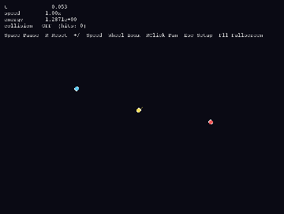<br/>
      <sub><b>Figure-8</b><br/>Chenciner–Montgomery</sub>
    </td>
    <td align="center" width="33%">
      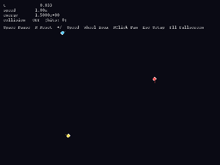<br/>
      <sub><b>Lagrange Triangle</b><br/>equilateral rotation</sub>
    </td>
    <td align="center" width="33%">
      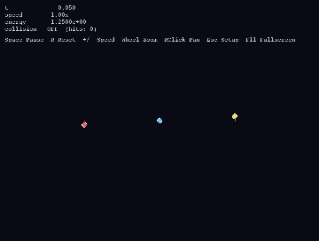<br/>
      <sub><b>Euler Collinear</b><br/>three-in-a-line rotation</sub>
    </td>
  </tr>
</table>

### Šuvakov–Dmitrašinović family (2013+)

<table>
  <tr>
    <td align="center" width="33%">
      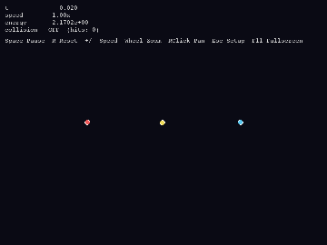<br/>
      <sub><b>Butterfly I</b></sub>
    </td>
    <td align="center" width="33%">
      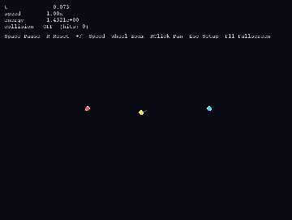<br/>
      <sub><b>Yin-Yang I</b></sub>
    </td>
    <td align="center" width="33%">
      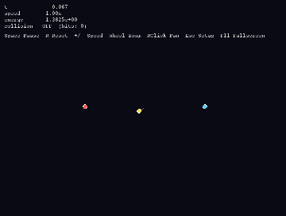<br/>
      <sub><b>Moth I</b></sub>
    </td>
  </tr>
  <tr>
    <td align="center" width="33%">
      <br/>
      <sub><b>Moth III</b></sub>
    </td>
    <td align="center" width="33%">
      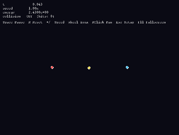<br/>
      <sub><b>Goggles</b></sub>
    </td>
    <td align="center" width="33%">
      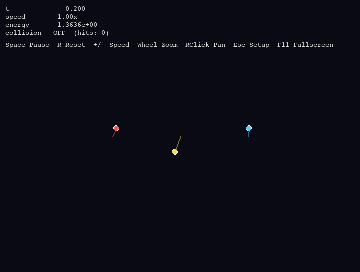<br/>
      <sub><b>Bumblebee</b></sub>
    </td>
  </tr>
</table>

### Chaotic orbits and scenarios

<table>
  <tr>
    <td align="center" width="33%">
      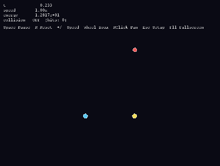<br/>
      <sub><b>Pythagorean (Burrau)</b><br/>3:4:5 free-fall, binary + ejection</sub>
    </td>
    <td align="center" width="33%">
      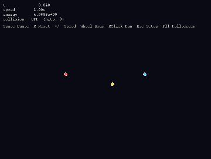<br/>
      <sub><b>Free-Fall Periodic</b><br/>Li–Liao 2019 family</sub>
    </td>
    <td align="center" width="33%">
      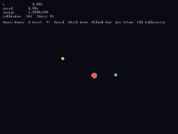<br/>
      <sub><b>Slingshot</b><br/>gravity-assist escape</sub>
    </td>
  </tr>
  <tr>
    <td align="center" width="33%">
      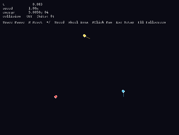<br/>
      <sub><b>Trojan L4</b><br/>Lagrange-point co-orbit</sub>
    </td>
    <td align="center" width="33%">
      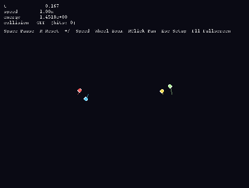<br/>
      <sub><b>Hierarchical + Moon</b><br/>chaotic tidal forcing</sub>
    </td>
    <td align="center" width="33%">
      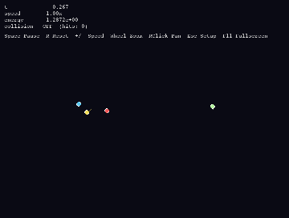<br/>
      <sub><b>Figure-8 + Planet</b><br/>circumtriple companion</sub>
    </td>
  </tr>
</table>

> Full-resolution MP4 versions of every demo live alongside the GIFs in [`assets/`](assets/).
> Regenerate all of them with `python scripts/record_demos.py`.

<!--
  To embed videos that play inline on GitHub, drag-and-drop the .mp4 files
  into a GitHub issue/PR comment, then paste the generated
  https://github.com/user-attachments/assets/<id> URL here with an <video> tag:

  <video src="https://github.com/user-attachments/assets/<id>" controls width="100%"></video>
-->

## Features

- **Classical RK4 integrator** with Plummer softening for stable close-encounter behavior
- **Built-in presets** of well-known periodic and chaotic solutions (natural units, G = 1)
- **Custom initial conditions** — set mass, position, and velocity for each body through the UI
- **Real-time controls** — pause/resume, reset, adjust time scale, trail length, and toggle collisions
- **Interactive camera** — mouse-wheel zoom, right-click drag to pan, auto-fit on start
- **Resizable window and fullscreen** (F11)

## Installation

Requires Python 3.9+.

```bash
git clone https://github.com/<your-username>/trisolaris.git
cd trisolaris
pip install -r requirements.txt
```

Dependencies: `pygame`, `pygame_gui`, `numpy`.

## Usage

```bash
python main.py
```

### Setup screen

Pick a preset from the dropdown or choose **Custom** and fill in mass, position `(x, y)`, and velocity `(vx, vy)` for each body. Click **Start** to run the simulation.

### Simulation controls

| Action                | Input                                |
| --------------------- | ------------------------------------ |
| Pause / resume        | `Space` or Play button               |
| Reset                 | `R` or Reset button                  |
| Speed up / slow down  | `+` / `-` or the speed slider        |
| Zoom                  | Mouse wheel                          |
| Pan                   | Right-click drag                     |
| Trail length          | Trail slider                         |
| Toggle collisions     | Collision button                     |
| Back to setup         | `Esc` or Back button                 |
| Toggle fullscreen     | `F11`                                |

### Included presets

Classical solutions
- **Figure-8** — Chenciner–Montgomery choreography (equal masses chase along a lemniscate)
- **Lagrange Triangle** — equal masses at the vertices of a rotating equilateral triangle
- **Euler Collinear** — three equal masses rigidly rotating along a straight line

Šuvakov–Dmitrašinović 2013 family (equal-mass planar periodic)
- **Butterfly I**, **Yin-Yang I**, **Moth I**, **Moth III**, **Goggles**, **Bumblebee**

Free-fall and chaos
- **Free-Fall Periodic** — Li–Liao (2019) solution starting entirely from rest
- **Pythagorean (Burrau)** — the 3:4:5 mass free-fall benchmark; ends in a binary + ejection

Hierarchical systems and scenarios
- **Sun + 2 Planets**, **Hierarchical Triple**, **Hierarchical + Moon**
- **Figure-8 + Planet** — a circumtriple test particle around the figure-eight system
- **Trojan L4** — a test body co-orbiting at a Lagrange equilibrium point
- **Slingshot** — a gravity-assist flyby past a planet orbiting a massive star

- **Random** / **Custom** — randomized or hand-entered initial conditions

## Project structure

```
trisolaris/
├── main.py          # Entry point and event loop
├── physics.py       # RK4 integrator and Body dataclass
├── simulation.py    # Simulation state: bodies, trails, collisions
├── camera.py        # World↔screen transforms, pan/zoom
├── renderer.py      # Scene drawing
├── ui_setup.py      # Initial-conditions UI
├── ui_controls.py   # In-simulation control bar
├── presets.py       # Famous three-body solutions
├── requirements.txt
├── assets/          # GIF + MP4 demo reels
└── scripts/
    └── record_demos.py  # Headless recorder (regenerates assets/)
```

## Physics notes

- Units are natural with `G = 1`. Preset solutions use equal masses of 1 unless noted.
- Integration uses fixed-step classical RK4. Per-preset recommended step sizes live in `presets.py` (`PRESET_DT`). Tighter orbits (e.g. Butterfly I) need smaller steps.
- A Plummer-style softening length (`SOFTENING = 1e-3` in `physics.py`) prevents divergence during close encounters. Disable or reduce it for stricter Keplerian behavior.
- Collisions, when enabled, merge bodies with momentum conservation.

## Contributing

Contributions are welcome. Some ideas:

- Higher-order or symplectic integrators (Yoshida, IAS15, WHFast)
- Energy / angular-momentum drift plots
- Export trajectories to CSV or video
- Additional named solutions (Broucke–Hénon family, Moore's figure-eight variants)

Please open an issue to discuss larger changes before submitting a PR. For bug reports, include your OS, Python version, and the preset or initial conditions that reproduce the problem.

## License

Released under the MIT License. See [LICENSE](LICENSE) for details.

## References

- Chenciner, A. & Montgomery, R. (2000). *A remarkable periodic solution of the three-body problem in the case of equal masses.* Annals of Mathematics, 152, 881–901.
- Šuvakov, M. & Dmitrašinović, V. (2013). *Three classes of Newtonian three-body planar periodic orbits.* Physical Review Letters, 110, 114301.
- Press, W. H. et al. *Numerical Recipes*, 3rd ed. (Runge–Kutta methods).
